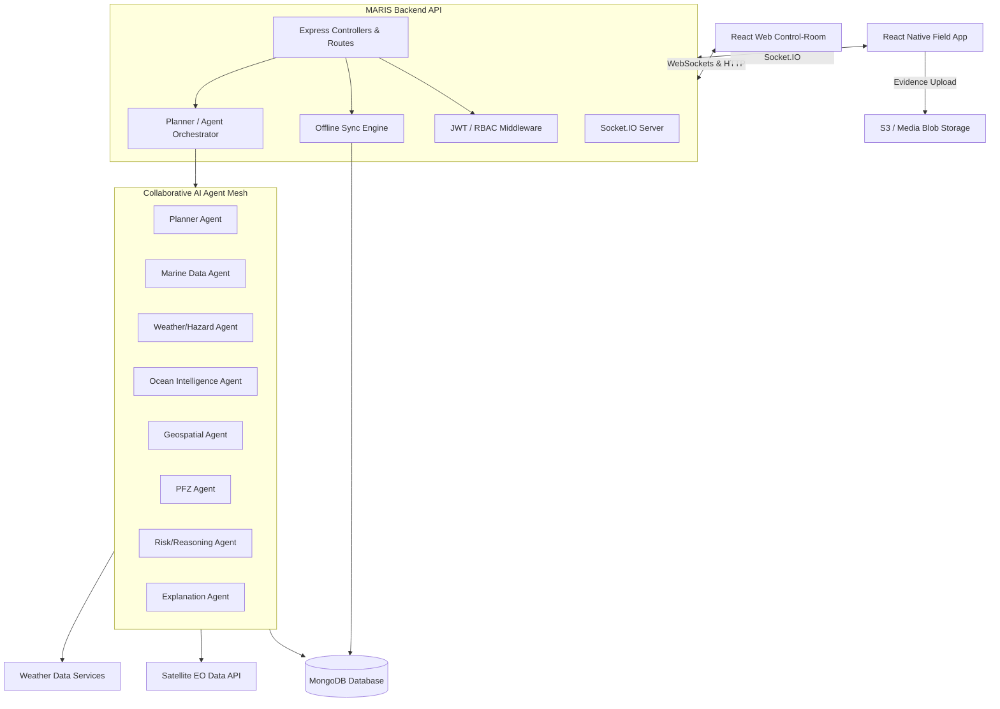
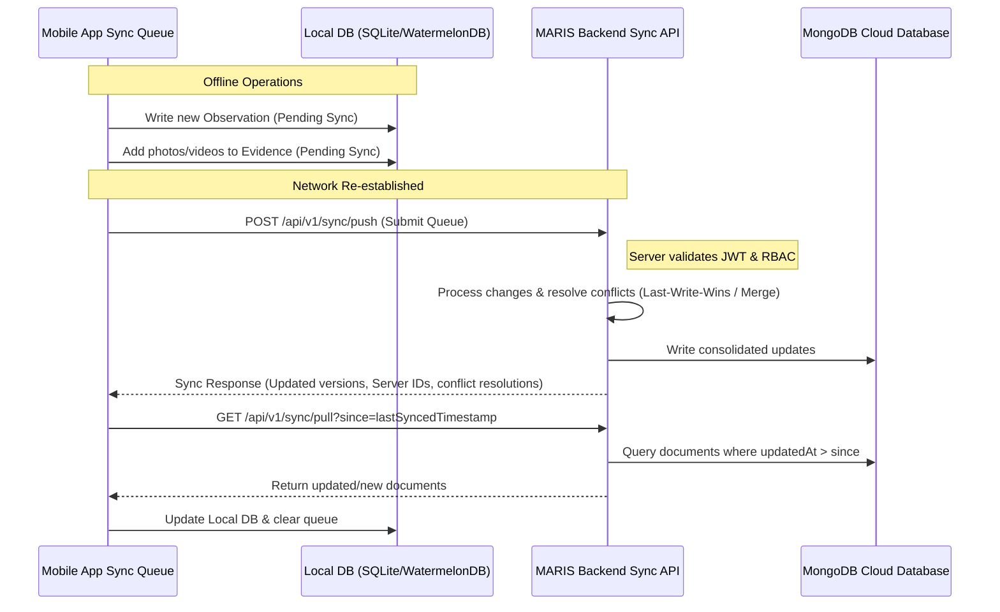

# MARIS Architecture — Agentic Marine Intelligence Platform

This document describes the architectural blueprint for **MARIS**, an Agentic AI-powered Marine Intelligence Platform designed to connect satellite Earth Observation, oceanographic, weather, geospatial, and field intelligence into explainable, context-aware decision support.

This architecture is aligned with the **SIH Problem Statement 26176: ORCA Marine EcOsystem Reasoning with Collaborative Agents**.

---

## 1. System Architecture Overview

MARIS is designed as a **Monorepo** to ensure tight coupling of types and schemas, while maintaining clean separation of concerns between backend services, web interfaces, and mobile applications.

### Monorepo Structure Layout
```
/Users/riteshmishra/Developer/SIH-Project/
├── packages/
│   └── shared/                 # Shared TS interfaces, Zod schemas, and utility types
├── apps/
│   ├── backend/                # Node.js + Express + TypeScript + Mongoose + Socket.IO
│   ├── web-portal/             # React + TypeScript (Vite) Control-Room Portal
│   └── mobile-app/             # React Native + TypeScript Offline-First Field App
```

### High-Level Architecture Flow


---

## 2. Collaborative Multi-Agent Architecture

MARIS employs a multi-agent orchestration pattern where specialized agents work together to execute plans and generate recommendations.

### The Core Flow
The platform translates user or automated triggers through the following stages:
$$\text{ASK} \rightarrow \text{PLAN} \rightarrow \text{DISCOVER} \rightarrow \text{CORRELATE} \rightarrow \text{REASON} \rightarrow \text{EXPLAIN} \rightarrow \text{RECOMMEND} \rightarrow \text{ACT/OBSERVE} \rightarrow \text{LEARN}$$

1. **ASK**: User enters a query (e.g., "Recommend safe Potential Fishing Zones for Vessel X tonight").
2. **PLAN**: **Planner Agent** parses the query and generates a step-by-step discovery and analysis plan.
3. **DISCOVER**: **Marine Data**, **Weather/Hazard**, and **PFZ** Agents fetch satellite SST (Sea Surface Temperature), chlorophyll levels, weather forecasts, and historical records.
4. **CORRELATE**: **Geospatial Agent** aligns spatial layers (raster charts, bathymetry, vector zones).
5. **REASON**: **Risk/Reasoning Agent** checks safety rules, vessel parameters, and operational constraints.
6. **EXPLAIN**: **Explanation Agent** structures the output, detailing why specific recommendations were made, using explicit reasoning steps (Evidence, Inference, Confidence, Recommendations).
7. **RECOMMEND**: Formulated recommendations are presented to the operator/field user.
8. **ACT/OBSERVE**: Field agents act on recommendation and capture new evidence (e.g., catch logs, SST readings, wave photos).
9. **LEARN**: Field observations are fed back into the system to improve future agent plans and model parameters.

### Agent Directory & Capabilities
- **Planner Agent**: Decomposes user goals into executable tasks for sub-agents; maintains global session state and monitors task execution.
- **Marine Data Agent**: Queries Earth Observation imagery, chlorophyll indexes, and oceanographic data sources.
- **Weather/Hazard Agent**: Tracks storms, wave heights, currents, wind profiles, and marine safety advisories.
- **Ocean Intelligence Agent**: Analyzes bathymetry, sea state, currents, and ocean current boundaries.
- **Geospatial Agent**: Evaluates coordinates, performs spatial intersections, and manages GeoJSON entities.
- **PFZ Agent**: Analyzes SST gradients and ocean color/chlorophyll fronts to identify potential high-yield fishing zones.
- **Risk/Reasoning Agent**: Synthesizes inputs to calculate safety risks, fuel-efficiency metrics, and regulatory constraints.
- **Explanation Agent**: Translates raw agent execution graphs into structured, human-readable rationales, distinguishing facts (direct observations) from inferences (predictions).

---

## 3. Backend Directory Structure

The backend application is structured around Domain-Driven Design (DDD) and Clean Architecture principles to keep business logic isolated from infrastructure dependencies.

```
/apps/backend/
├── src/
│   ├── config/                     # Environment variables, DB connections, global settings
│   ├── domain/                     # Pure Enterprise Business Rules
│   │   ├── entities/               # User, Observation, Alert, Session, AgentTask
│   │   ├── value-objects/          # GPSCoordinate, EvidenceMedia, ConfidenceLevel
│   │   └── services/               # Core business rules (e.g., risk scoring logic)
│   ├── application/                # Application Use Cases & Orchestration
│   │   ├── use-cases/              # SyncData, ProcessObservation, GeneratePFZAlert
│   │   └── agents/                 # Multi-agent orchestrator & agent modules
│   │       ├── orchestrator.ts     # Coordination engine
│   │       └── specialized/        # Individual agent implementations
│   ├── infrastructure/             # Frameworks, Drivers, and Tools
│   │   ├── database/               # Mongoose schemas, indexes, and connections
│   │   │   ├── models/             # User.model.ts, Observation.model.ts, etc.
│   │   │   └── repositories/       # Data-access implementations
│   │   ├── services/               # External APIs, Satellite data parsers, Weather services
│   │   ├── websockets/             # Socket.IO event registers and connection management
│   │   └── auth/                   # JWT generation, RBAC rules verification
│   ├── presentation/               # External interfaces (HTTP/WebSocket entrypoints)
│   │   ├── http/                   # Express App, Routing, Middleware, Controllers
│   │   │   ├── controllers/        # AuthController, ObservationController, AlertController
│   │   │   ├── middlewares/        # AuthMiddleware, RoleGuard, ErrorHandler
│   │   │   └── routes/             # v1Router, authRouter, observationRouter
│   │   └── socket/                 # Real-time event controllers
│   │       └── observation.socket.ts
│   └── app.ts                      # Express/Server initialization
└── tsconfig.json
```

---

## 4. Offline-First Synchronization Engine

A core business principle of MARIS is that **offline functionality is a first-class citizen**. The mobile field app must operate seamlessly without connectivity, queueing operations locally, capturing evidence, and synchronizing once online.

### Synchronization Attributes
All syncable database documents contain the following metadata schema:
- `version: Number` — Monotonically increasing version counter.
- `updatedAt: Date` — Last modification timestamp.
- `createdAt: Date` — Record creation timestamp.
- `isDeleted: Boolean` — Soft deletion flag to capture deletions offline.
- `lastSyncedAt: Date` — The timestamp when the record was last pushed or pulled.

### Synchronization Flow & Protocol


### Local Sync Queue Design (React Native)
- **Queue Table**: Stores actions (`CREATE`, `UPDATE`, `DELETE`), payloads, target entity types, and timestamps.
- **Media Sync Strategy**:
  1. Image/video evidence captured on field is stored locally in the application sandbox.
  2. The sync job first uploads the media to binary storage (S3/MinIO) via a pre-signed URL.
  3. Upon successful media upload, the URL references are added to the sync queue item.
  4. The JSON payload is then synced to the main REST API.

---

## 5. Shared Data Contracts

These data contracts are defined in `packages/shared` and exported as TypeScript interfaces and Zod validation schemas to be used across Backend, Web, and Mobile codebases.

### Field Observation & Evidence Capture
```typescript
export interface GPSLocation {
  latitude: number;
  longitude: number;
  altitude?: number;
  accuracy?: number; // In meters
}

export interface EvidenceMedia {
  id: string;
  type: 'image' | 'video' | 'audio';
  localUri: string;      // Used offline
  remoteUrl?: string;    // populated after upload
  capturedAt: Date;
  fileHash?: string;     // SHA-256 validation of the evidence file
}

export interface ObservationItem {
  id: string;
  observerId: string;
  location: GPSLocation;
  timestamp: Date;
  category: 'sst_reading' | 'chlorophyll_sample' | 'vessel_spotting' | 'marine_life' | 'weather_custom';
  value: string;         // E.g., "28.5C", "3 vessels"
  confidence: number;    // 0.0 - 1.0 (reported by observer or local device)
  evidence: EvidenceMedia[];
  notes?: string;
  isSynced: boolean;
  version: number;
}
```

### Agent Interaction Protocol
```typescript
export interface ReasoningStep {
  agentName: string;
  stepType: 'DISCOVER' | 'CORRELATE' | 'REASON' | 'EXPLAIN';
  evidence: string[];    // Hard facts, satellite links, field observations
  inference: string;    // Predictions, logic calculations
  confidence: number;   // 0.0 - 1.0
  recommendation?: string;
  timestamp: Date;
}

export interface AgentSession {
  sessionId: string;
  userId: string;
  prompt: string;
  status: 'PENDING' | 'PLANNING' | 'EXECUTING' | 'COMPLETED' | 'FAILED';
  plan: string[];        // List of sub-tasks designed by Planner
  steps: ReasoningStep[];
  finalExplanation?: string;
  createdAt: Date;
}
```

### Marine Alerts & PFZ Advisories
```typescript
export interface GeoJSONPolygon {
  type: 'Polygon';
  coordinates: number[][][]; // GeoJSON format [[[lng, lat], ...]]
}

export interface MarineAlert {
  id: string;
  type: 'PFZ' | 'STORM' | 'OIL_SPILL' | 'CYCLONE' | 'VMS_ANOMALY';
  severity: 'INFO' | 'WARNING' | 'CRITICAL';
  area: GeoJSONPolygon;
  title: string;
  description: string;
  confidence: number;   // Calculated by Risk/Reasoning Agent
  sources: string[];    // Evidence sources (e.g., Sentinel-3, INSAT-3D, Field Report #92)
  validFrom: Date;
  validTo: Date;
  createdAt: Date;
}
```

---

## 6. Risks and Technical Conflicts

1. **Schema Evolution & Versioning**: Because offline clients can run outdated versions of the mobile application, server-side migration and synchronization handlers must explicitly check schema compatibility.
2. **LLM Latency in Multi-Turn Agent Loop**: The core loop (ASK to LEARN) involves multiple reasoning steps. If each step executes a distinct LLM prompt synchronously, the user response time could exceed 10-15 seconds.
   - *Mitigation*: Employ a streaming interface via Socket.IO, reporting steps in real-time to the UI as they execute.
3. **Database Performance with Geospatial Intersections**: MongoDB 2dsphere indexes are performant, but querying dynamic overlapping polygons for multiple moving vessels real-time can put high CPU pressure.
   - *Mitigation*: Implement a Redis caching layer for active alerts and pre-filter alerts using geohashes.
4. **Binary Data Upload Reliability**: In remote marine environments, internet connections are highly unstable. Sending large image/video evidence uploads directly inside JSON payloads will cause timeouts.
   - *Mitigation*: Evidence files must be uploaded out-of-band via chunked uploads to S3, independent of the main sync transaction.
