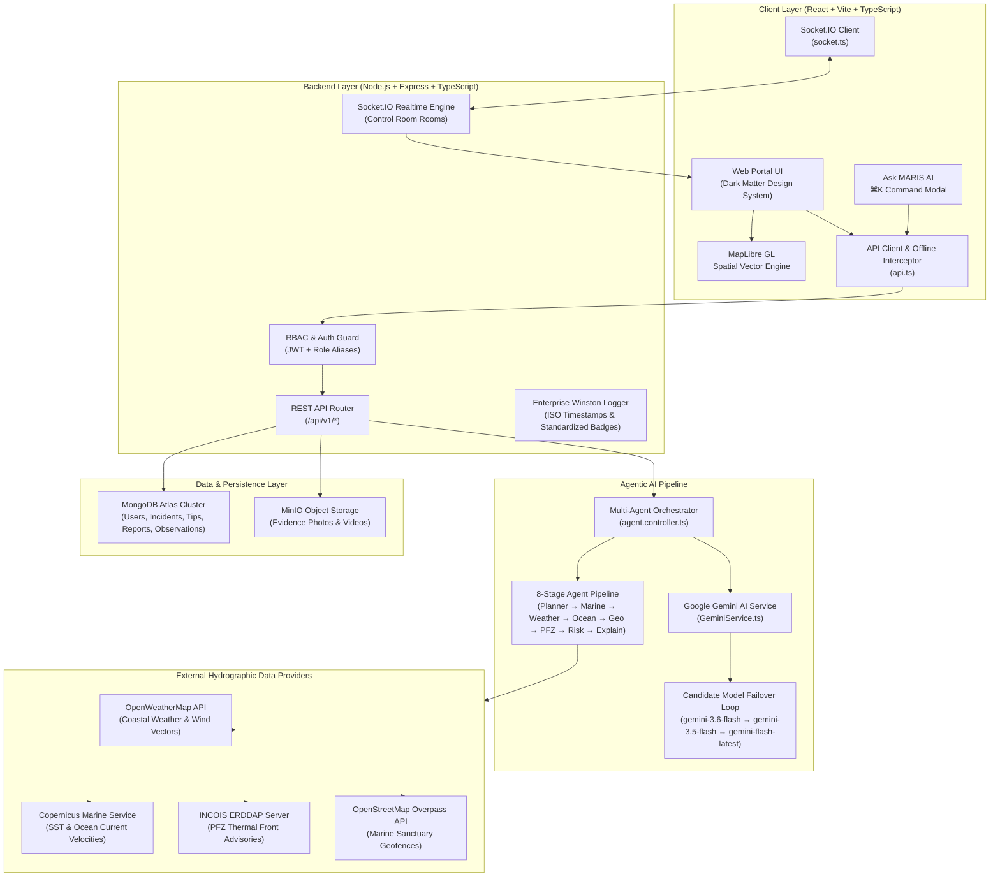
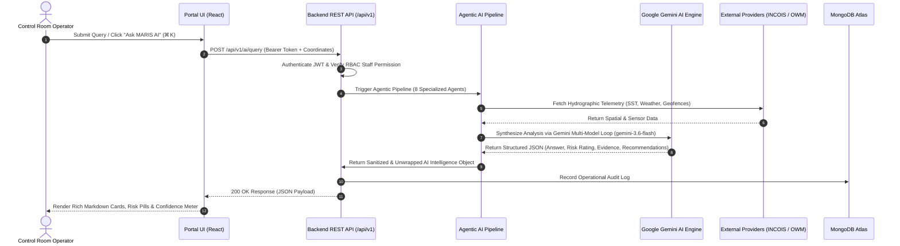
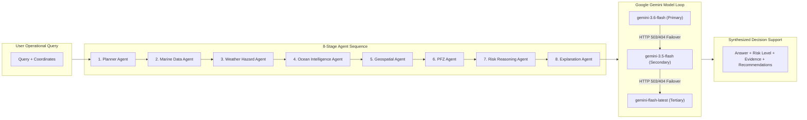
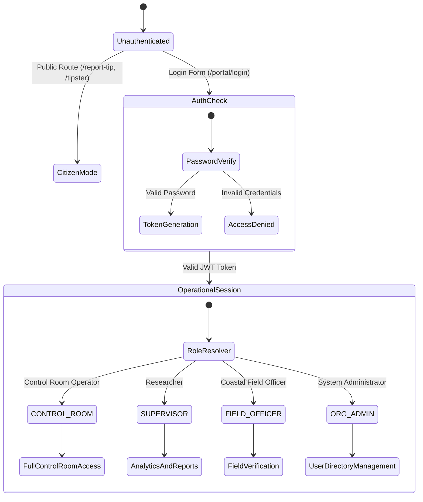

# 🌊 MARIS Architecture & System Design

**MARIS** (Marine Intelligence & Operational AI Frontier) is an enterprise-grade agentic marine reasoning and operational control room platform designed for SIH Problem Statement 26176.

---

## 1. System Architecture Overview

---

## 2. End-to-End Operational Data Flow

---

## 3. Agentic AI Pipeline Architecture

---

## 4. Role-Based Access Control (RBAC) & Security Provenance

---

## 5. Technology Stack Summary

| Layer | Component / Technology | Purpose |
| :--- | :--- | :--- |
| **Frontend UI** | React 18, Vite, TypeScript | Modern, high-performance Single Page Application |
| **Map Engine** | MapLibre GL (`maplibre-gl`) | Vector map engine rendering live vessel locations, alerts, and PFZ layers |
| **Styling** | Dark Matter Design System, Glassmorphism, HSL | Premium, high-contrast dark and light mode UI components |
| **Backend Framework** | Node.js, Express, TypeScript | RESTful APIs & WebSocket server |
| **Realtime** | Socket.IO (`socket.io`) | Low-latency bi-directional control room event broadcasting |
| **Database** | MongoDB Atlas, Mongoose ODM | Cloud-hosted document database for persistent operational records |
| **Object Storage** | MinIO Storage Provider | S3-compatible media provenance storage for evidence uploads |
| **AI Decision Engine** | Google Gemini AI (`GeminiService`) | Resilient multi-agent reasoning with model failover loop |
| **Logging** | Winston (`winston`) | Enterprise ISO-8601 color-coded operational log stream |
