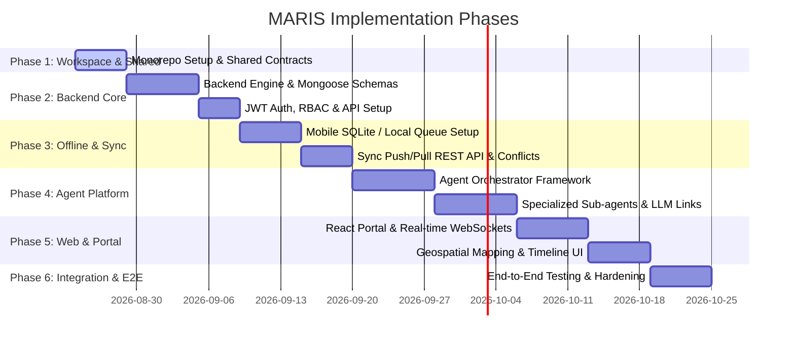

# MARIS Development Plan — Step-by-Step Implementation Roadmap

This document outlines the phased development roadmap for **MARIS** (Agentic Marine Intelligence Platform), ensuring code quality, testing boundaries, and strict dependency ordering.

We prioritize backend and data contracts over frontend interfaces, ensuring the agent reasoning and offline sync engine are stable before building any UI views.

---

## Roadmap Overview

---

## Phase 1: Workspace Setup & Shared Contracts

**Objective**: Establish a robust monorepo development environment and shared type safety interfaces.

### Step 1.1: Monorepo Workspace Initialization
- Create workspace root directories.
- Configure root `package.json` with workspace settings (supporting `/apps/*` and `/packages/*`).
- Configure root `tsconfig.json` defining path aliases, compilation options, and project references.
- Implement ESLint and Prettier configurations across the workspaces.

### Step 1.2: Establish Shared TypeScript Packages
- Initialize `packages/shared/`.
- Code TypeScript models and interfaces for:
  - Observation records and offline sync parameters (GPS, confidence, metadata).
  - Agent communication protocols (Session, Steps, Explanation).
  - Marine Alerts, PFZ Advisories, and GeoJSON shapes.
- Implement Zod schema validations for client-side and server-side request sanitization.
- Compile packages and link to the packages registry.

---

## Phase 2: Backend Core Engine & Database

**Objective**: Spin up the API server, connect the database models, and build security boundaries.

### Step 2.1: Node.js/Express Initialization
- Setup `apps/backend/` using TypeScript.
- Build server bootstrap code (`src/app.ts`), setting up global middleware (CORS, body parser, helmet).
- Implement standard global error handling and request logging (Winston or Morgan).

### Step 2.2: Mongoose Schemas & Database Connection
- Configure connection pool to MongoDB.
- Build Mongoose models in `src/infrastructure/database/models/`:
  - `User` (credentials, role matching RBAC: Observer, Operator, Admin).
  - `Observation` (storing GPS, evidence media metadata, sync tracking).
  - `Alert` (GeoJSON polygon, storm/PFZ metadata).
  - `AgentSession` (storing user prompt, execution graph status, steps log).
- Define 2dsphere indexes on geospatial coordinate and area properties to support polygon queries.

### Step 2.3: Security, Auth & RBAC
- Implement JWT generation and token validation middleware.
- Code Role-Based Access Control (RBAC) checks (e.g., `checkRole(['Operator', 'Admin'])`).
- Configure secure password hashing using bcrypt.

### Step 2.4: Socket.IO Server Setup
- Integrate Socket.IO into the HTTP server.
- Establish Socket connection auth checking (validating JWT during handshake).
- Define base event routers for broadcasting alerts and streaming agent execution steps.

---

## Phase 3: Offline-First Sync Engine & Mobile App Foundation

**Objective**: Implement the offline-first capability in the React Native app and design the sync handler.

### Step 3.1: Mobile Foundation & Local DB Setup
- Setup a React Native app in `apps/mobile-app/` using TypeScript.
- Integrate a local database: **WatermelonDB** or **SQLite** (using SQLite modules).
- Define local database schemas matching the shared data contracts (Observations, Media evidence, SyncQueue).

### Step 3.2: Local Sync Queue implementation
- Code a React Native module/class to manage the client queue:
  - `enqueueAction(actionType, payload)`: Inserts action (`CREATE`/`UPDATE`) into local sync queue database.
  - `processSyncQueue()`: Sequentially executes tasks.
- Implement offline image/video evidence storage into the local sandbox filesystem.

### Step 3.3: Server-side Sync Handlers
- Build `POST /api/v1/sync/push` on the backend:
  - Takes batch queue updates, validates transaction ordering.
  - Resolve conflicts using a metadata version check. Last-Write-Wins (LWW) is the default; implement properties merging when fields are distinct.
  - Returns IDs mapping local temp IDs to database ObjectID strings, and updated versions.
- Build `GET /api/v1/sync/pull` on the backend:
  - Fetches updates since a client's `lastSyncedAt` timestamp.
- Build pre-signed URL upload routes to S3/MinIO for binary evidence objects.

---

## Phase 4: Collaborative Agent Platform

**Objective**: Implement the Planner and specialized sub-agents to enable the reasoning flow.

### Step 4.1: Agent Core & Orchestrator Framework
- Implement the orchestrator state engine (`src/application/agents/orchestrator.ts`).
- Define base class `BaseAgent` and session tracking interface.
- Implement the `PlannerAgent`:
  - Receives user query.
  - Utilizes prompt templates to generate a structured JSON execution plan containing steps and target sub-agents.

### Step 4.2: Sub-Agent Implementations
- Code specialized agent classes:
  - **Marine Data Agent**: Integrates Copernicus/NOAA endpoints (or robust mock adapters for temperature and chlorophyll rasters).
  - **Weather/Hazard Agent**: Integrates OpenWeatherMap/IMD alerts.
  - **Geospatial Agent**: Uses Turf.js to analyze whether coords fall inside active warning zones.
  - **PFZ Agent**: Analyzes SST boundaries and ocean color parameters.
  - **Risk/Reasoning Agent**: Integrates safety thresholds (vessel limits vs wind speed).
  - **Explanation Agent**: Structures findings using the reasoning model (Evidence -> Inference -> Confidence -> Recommendation).
- Build streaming mechanisms to push intermediate reasoning steps to client Socket connections.

---

## Phase 5: React Web Portal & Control-Room Dashboard

**Objective**: Create the operators' control interface and hook up the real-time streams.

### Step 5.1: Web App Setup & Socket link
- Initialize React + TS application in `apps/web-portal/` using Vite.
- Implement client Socket.IO service matching server endpoints.
- Create UI stores (Zustand or Redux) to manage application state (Alerts list, Active Agent sessions).

### Step 5.2: Geospatial Map Panel
- Integrate MapLibre GL or Leaflet.
- Plot active fishing zones (PFZ coordinates), marine storm grids, and active vessel locations.
- Implement real-time coordinate updates broadcasted from mobile clients.

### Step 5.3: Agent Reasoning Monitor
- Create the **Agent Execution Timeline**:
  - Live streams execution phases (ASK to LEARN) as they complete.
  - Renders distinct visual blocks detailing:
    - *Evidence* (e.g. satellite measurements).
    - *Inference* (computed risks).
    - *Confidence* (percentage metrics).
    - *Recommendations* (safe headings/PFZ targets).

---

## Phase 6: Integration, Validation, and Hardening

**Objective**: End-to-End quality verification and deployment prep.

### Step 6.1: Integration Testing
- Create testing scenarios:
  1. Field operator turns off internet -> records ocean temperature observation + takes photos.
  2. Operator turns on internet -> queue is synced to server.
  3. Observation triggers Weather Hazard assessment on the server.
  4. Storm warning polygon is broadcasted in real-time to the web portal.
- Verify audit log integrity.

### Step 6.2: Security Auditing
- Verify Socket.IO authentication holds under reconnection scenarios.
- Verify RBAC roles prevent field observers from deleting alerts or modifying system configurations.
- Sanitize database query builders to prevent injection.

### Step 6.3: Containerization & Deployment
- Write Dockerfiles for backend, web app nginx build, and DB initialization.
- Configure `docker-compose.yml` for local multi-container development.
